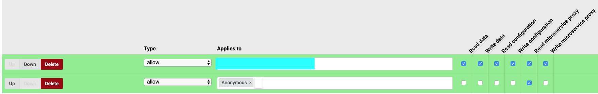

# Microsoft Planner Connector

## Prerequisites

1. Python3
2. Azure account

### Running the script in development requires environment variables
**Obs.** Some of the below env variables you wont have immediately.
Set the following env variables in 'service.py' :

```
os.environ['client_id'] = '<Azure client ID>'
os.environ['client_secret'] = '<Azure client Secret>'
os.environ['tenant_id'] = '<Azure tenant ID>'
os.environ['refresh_token'] = '<Granted refresh token after sign in>'
```

### Register a web application with the Azure Active Directory admin center

1. Open a browser and navigate to the [Azure Active Directory admin center](https://aad.portal.azure.com).

2. Select **New registration**. On the **Register an application** page, set the value as follows.

    - Set **Name** to `<Some Nice Name>`.

3. Choose **Register**. On the **Name** page, copy the value of the **Application (client) ID** and save it, you will need it later.

4. Select **Certificates & secrets** under **Manage**. Select the **New client secret** button. Enter a value in **Description** and select one of the options for **Expires** and choose **Add**.

5. Enter the values provided as environment variables when working on this repo in development.

### Running the app in development.

Go into package.json and follow the instructions to run the app.

### Connecting to the Microservice in SESAM.

1. Make a **temporary** system in Sesam as shown below :
    ```
    {
      "_id": "planner-connector",
      "type": "system:microservice",
      "docker": {
        "environment": {
          "client_id": "$ENV(azure-client-id)",
          "client_secret": "$SECRET(azure-client-secret)",
          "tenant_id": "$ENV(azure-tenant-id)"
        },
        "image": "sesamcommunity/microsoft-planner-connector:latest",
        "port": 5000
      },
      "proxy": {
        "header_blacklist": ["CUSTOM_AUTHORIZATION"],
        "sesam_authorization_header": "CUSTOM_AUTHORIZATION"
      },
      "verify_ssl": true
    }
    ```

2. Connect to the system via the /proxy/ route to generate tokens :

    1. Go into the System permissions tab and under 'local Permissions' add the following :

        

    2. Go to the following url to aquire and save refresh token as instructed.
        url example :

        https://<"your_node_ID">.sesam.cloud/api/systems/<"your_system_id">/proxy/

        After authentification, the system config should look like this :
        ```
        {
          "_id": "planner-connector",
          "type": "system:microservice",
          "docker": {
            "environment": {
              "client_id": "$ENV(azure-client-id)",
              "client_secret": "$SECRET(azure-client-secret)",
              "tenant_id": "$ENV(azure-tenant-id)",
              "refresh_token": "$SECRET(refresh_token)"
            },
            "image": "sesamcommunity/microsoft-planner-connector:latest",
            "port": 5000
          },
          "verify_ssl": true
        }
        ```

3. Pipe config :

**Obs.** in the Datahub tab under Settings, remember to set the defined $ENV's in the system config needed for connecting to the docker image.
```
{
  "_id": "planner-connector-ms",
  "type": "pipe",
  "source": {
    "type": "json",
    "system": "planner-connector",
    "url": "/planner/<dynamic value i.e. 'tasks'>"
  },
  "transform": {
    "type": "dtl",
    "rules": {
      "default": [
        ["copy", "*"]
      ]
    }
  }
}
```

Supported dynamic values for the url property :
1. tasks
2. plans
3. users
4. groups
